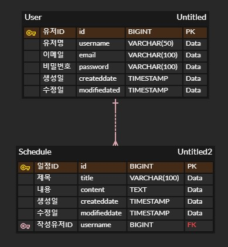

**Lv 0: API 명세서 작성**

1. 회원 가입

URL: POST /api/users

설명: 새로운 유저를 생성하고 회원가입을 완료합니다(이때, 비밀번호는 최소 6자리 이상 돼야 합니다).
    
요청 본문:
```json
{
  "username": "string",
  "email": "string",
  "password": "string"
}
```

응답:

성공(HTTP 200):
```json
{
  "id": "number",
  "username": "string",
  "email": "string",
  "createdData": "yyyy-MM-dd'T'HH:mm:ss",
  "modifiedDate": "yyyy-MM-dd'T'HH:mm:ss"
}
```
실패(HTTP 400, 유효하지 않은 요청 값):
```json
{
  "message": "유효하지 않은 요청입니다."
}
```
2. 로그인

URL: POST /api/login

설명: 유저 이메일과 비밀번호로 로그인합니다.

요청 본문:
```json
{
 "email": "string",
  "password": "string"
}
```
응답:

성공(HTTP 200):
```json
{
  "message": "로그인 성공"
}
```
실패(HTTP 401, 인증 실패):
```json
{
  "message": "이메일 또는 비밀번호가 일치하지 않습니다."
}
```
3. 일정 생성
   
URL: POST /api/schedules

설명: 새로운 일정을 생성합니다.

요청 본문:
```json
{
 "title": "string",
  "content": "string",
  "userId": "number"
}
```
응답:

성공(HTTP 200):
```json
{
  "id": "id",
  "title": "string",
  "content": "string",
  "userId": "number",
  "createdData": "yyyy-MM-dd'T'HH:mm:ss",
  "modifiedDate": "yyyy-MM-dd'T'HH:mm:ss"
}
```
실패(HTTP 400):
```json
{
  "message": "유효하지 않은 요청입니다."
}
```
4. 일정 조회

URL: GET /api/schedules/{id}

설명: 특정 일정의 세부 정보를 조회합니다.

응답:

성공(HTTP 200):
```json
{
  "id": "id",
  "title": "string",
  "content": "string",
  "userId": "number",
  "createdData": "yyyy-MM-dd'T'HH:mm:ss",
  "modifiedDate": "yyyy-MM-dd'T'HH:mm:ss"
}
```
실패(HTTP 404, 일정이 없는 경우):
```json
{
  "message": "일정을 찾을 수 없습니다."
}
```
5. 일정 수정

URL: PUT /api/schedules/{id}

설명: 특정 일정의 내용을 수정합니다.

요청 본문:
```json
{
 "title": "string",
  "content": "string"
}
```
응답:

성공(HTTP 200):
```json
{
  "id": "id",
  "title": "string",
  "content": "string",
  "userId": "number",
  "createdData": "yyyy-MM-dd'T'HH:mm:ss",
  "modifiedDate": "yyyy-MM-dd'T'HH:mm:ss"
}
```
실패(HTTP 404, 일정이 없는 경우):
```json
{
  "message": "일정을 찾을 수 없습니다."
}
```
6. 일정 삭제

URL: DELETE /api/schedules/{id}

설명: 특정 일정을 삭제합니다.

응답:

성공(HTTP 204, No Content): 빈 응답

실패(HTTP 404, 일정이 없는 경우):
```json
{
  "message": "일정을 찾을 수 없습니다."
}
```


schedules.sql

CREATE TABLE user
(
    id            BiGINT AUTO_INCREMENT PRIMARY KEY,
    username      VARCHAR(50)  NOT NULL,
    email         VARCHAR(100) NOT NULL UNIQUE,
    password      VARCHAR(100) NOT NULL,
    created_date  TIMESTAMP DEFAULT CURRENT_TIMESTAMP,
    modified_date TIMESTAMP DEFAULT CURRENT_TIMESTAMP ON UPDATE CURRENT_TIMESTAMP
);

CREATE TABLE schedule
(
    id            BiGINT AUTO_INCREMENT PRIMARY KEY,
    title         VARCHAR(100) NOT NULL,
    content       TEXT,
    user_id       BIGINT,
    created_date  TIMESTAMP DEFAULT CURRENT_TIMESTAMP,
    modified_date TIMESTAMP DEFAULT CURRENT_TIMESTAMP ON UPDATE CURRENT_TIMESTAMP,
    CONSTRAINT fk_user FOREIGN KEY (user_id) REFERENCES user (id)
);


<주요 구현 요약>
엔티티 생성: @Entity를 사용해 User와 Schedule 엔티티를 정의하고, 필요한 필드와 관계를 설정 및 JPA Auditing 설정합니다.
리포지토리 인터페이스: 각 엔티티에 대해 JpaRepository를 상속하는 인터페이스를 생성합니다.
서비스 클래스: 비즈니스 로직을 처리할 UserService와 ScheduleService를 구현하여 CRUD 로직을 정의합니다.
컨트롤러 생성: API 엔드포인트를 제공할 컨트롤러를 만들고, 각 CRUD 요청에 대해 핸들러 메서드를 작성합니다.
인증/인가 설정: 로그인 기능과 세션 관리 로직을 구현하고, 인증 필터를 설정하여 보호할 엔드포인트를 지정합니다.


<공통 조건>
3 Layer Architecture: 각 레벨별로 엔티티, 리포지토리, 서비스, 컨트롤러를 구현
JPA 기반 CRUD: 모든 CRUD 기능은 JPA와 관련된 어노테이션을 사용하여 구현하며, JDBC는 배제
JPA 연관관계: User와 Schedule 간의 1:N 단방향 연관관계로 설정하며, 필요에 따라 @ManyToOne, @JoinColumn을 사용해 관계 구성
JPA Auditing: 작성일과 수정일 필드는 JPA Auditing으로 자동 관리되도록 @CreatedDate와 @LastModifiedDate를 적용
Session/Cookie 인증/인가: 로그인과 세션 관리를 위한 Cookie/Session 방식을 활용하여 Spring Security 없이 사용자 인증/인가 기능을 구현 및 필터 설정과 예외 처리


<각 단계별 기능 구현>
Lv 1. 일정 CRUD

엔티티 설정:
Schedule 엔티티에 다음 필드를 추가:
작성 유저명 (String)
할일 제목 (String)
할일 내용 (String)
작성일 (LocalDateTime, JPA Auditing 활용)
수정일 (LocalDateTime, JPA Auditing 활용)

Repository 생성:
ScheduleRepository 인터페이스를 생성하고, JpaRepository<Schedule, Long>를 상속하여 기본 CRUD 메서드를 사용 가능하도록 설정.

Service 구현:
일정 저장, 조회, 수정, 삭제 메서드를 구현.

Controller 생성:
일정과 관련된 각 요청에 대해 핸들러 메서드 작성 (예: /api/schedules).


Lv 2. 유저 CRUD

엔티티 설정:
User 엔티티에 다음 필드 추가:
유저명 (String)
이메일 (String)
작성일 (LocalDateTime, JPA Auditing 활용)
수정일 (LocalDateTime, JPA Auditing 활용)

Repository 생성:
UserRepository 인터페이스를 생성하고, JpaRepository<User, Long> 상속하여 기본 CRUD 메서드를 사용.

연관관계 설정:
Schedule 엔티티의 작성 유저명 필드를 user_id(외래 키)로 변경하여 User와 연관관계를 설정 (@ManyToOne).

Service 및 Controller 구현:
UserService와 UserController에서 유저 관련 CRUD 메서드 작성.


Lv 3. 회원가입

비밀번호 필드 추가:
User 엔티티에 password 필드 추가 (String).

Sign Up API 생성:
회원가입 요청에 대해 UserService에서 사용자 정보를 저장하도록 구현.


Lv 4. 로그인 (인증)

로그인 요청 처리:
로그인 요청에서 사용자의 이메일과 비밀번호를 받아서 UserService에서 조회.

Session/Cookie 활용:
세션을 통해 로그인 상태를 관리하고 HttpServletRequest와 HttpServletResponse를 사용해 세션 생성.

필터 설정:
인증 필터를 구현하고 @Configuration을 사용해 등록하여 로그인된 사용자만 일정에 접근할 수 있도록 설정.
회원가입, 로그인 요청은 필터 대상에서 제외.

예외 처리:
로그인 실패 시 401 Unauthorized 응답 반환.

