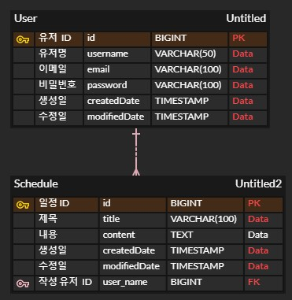

**Lv 0: API 명세서 작성**

1. 회원 가입

URL: POST /api/users

설명: 새로운 유저를 생성하고 회원가입을 완료합니다.
    
요청 본문:
```json
{
  "username": "string",
  "email": "string",
  "password": "string"
}
```

응답:

성공(HTTP 200):
```json
{
  "id": "number",
  "username": "string",
  "email": "string",
  "createdData": "yyyy-MM-dd'T'HH:mm:ss",
  "modifiedDate": "yyyy-MM-dd'T'HH:mm:ss"
}
```
실패(HTTP 400, 유효하지 않은 요청 값):
```json
{
  "message": "유효하지 않은 요청입니다."
}
```
2. 로그인

URL: POST /api/login

설명: 유저 이메일과 비밀번호로 로그인합니다.

요청 본문:
```json
{
 "email": "string",
  "password": "string"
}
```
응답:

성공(HTTP 200):
```json
{
  "message": "로그인 성공"
}
```
실패(HTTP 401, 인증 실패):
```json
{
  "message": "이메일 또는 비밀번호가 일치하지 않습니다."
}
```
3. 일정 생성
   
URL: POST /api/schedules

설명: 새로운 일정을 생성합니다.

요청 본문:
```json
{
 "title": "string",
  "content": "string",
  "userId": "number"
}
```
응답:

성공(HTTP 200):
```json
{
  "id": "id",
  "title": "string",
  "content": "string",
  "userId": "number",
  "createdData": "yyyy-MM-dd'T'HH:mm:ss",
  "modifiedDate": "yyyy-MM-dd'T'HH:mm:ss"
}
```
실패(HTTP 400):
```json
{
  "message": "유효하지 않은 요청입니다."
}
```
4. 일정 조회

URL: GET /api/schedules/{id}

설명: 특정 일정의 세부 정보를 조회합니다.

응답:

성공(HTTP 200):
```json
{
  "id": "id",
  "title": "string",
  "content": "string",
  "userId": "number",
  "createdData": "yyyy-MM-dd'T'HH:mm:ss",
  "modifiedDate": "yyyy-MM-dd'T'HH:mm:ss"
}
```
실패(HTTP 404, 일정이 없는 경우):
```json
{
  "message": "일정을 찾을 수 없습니다."
}
```
5. 일정 수정

URL: PUT /api/schedules/{id}

설명: 특정 일정의 내용을 수정합니다.

요청 본문:
```json
{
 "title": "string",
  "content": "string"
}
```
응답:

성공(HTTP 200):
```json
{
  "id": "id",
  "title": "string",
  "content": "string",
  "userId": "number",
  "createdData": "yyyy-MM-dd'T'HH:mm:ss",
  "modifiedDate": "yyyy-MM-dd'T'HH:mm:ss"
}
```
실패(HTTP 404, 일정이 없는 경우):
```json
{
  "message": "일정을 찾을 수 없습니다."
}
```
6. 일정 삭제

URL: DELETE /api/schedules/{id}

설명: 특정 일정을 삭제합니다.

응답:

성공(HTTP 204, No Content): 빈 응답

실패(HTTP 404, 일정이 없는 경우):
```json
{
  "message": "일정을 찾을 수 없습니다."
}
```
